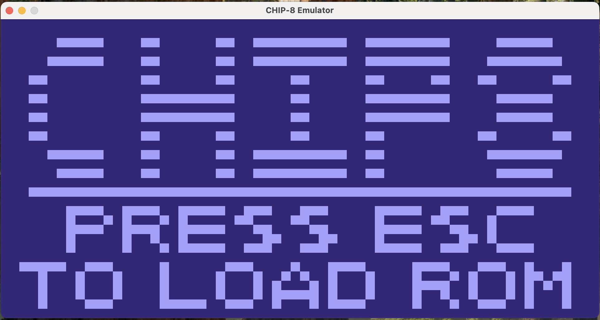

A CHIP-8 emulator written in Java and rendered with Swing, with no external runtime dependencies.
This implementation is based on
[Cowgod’s CHIP-8 Technical Reference](http://devernay.free.fr/hacks/chip8/C8TECH10.HTM) and
validated using [Timendus’s CHIP-8 test suite](https://github.com/Timendus/chip8-test-suite/).
All CHIP-8 instructions are fully implemented, and the emulator currently passes all tests in
the test suite. Sound support is implemented using the CHIP-8 sound timer and real-time audio
generation. The emulator boots into a custom splash screen and provides a settings screen for
configuring execution timing and display colors, as well as loading ROMs at runtime via the
**Escape** key.



Debugging
---------

Debugging and visibility still needs improvement. Currently all logging is system print statements.
The current machine state can be retrieved as a string using the MachineState class's
`currentState()` method

```
─────── Instruction Window  ───────
 Addr     Opcode  Assembly
 0x020A   A2A2    LD I, 2a2
 0x020C   6A00    LD v10, 0
 0x020E   6B00    LD v11, 0
 0x0210   FD33    LD B, v13
 0x0212   F265    LD v2, [I]
 0x0214   2276    CALL 276
 0x0216   A288    LD I, 288
 0x0218   7A07    ADD v10, 7
 0x021A   DAB5    DRAW v10, v11, 5
 0x021C   A2A2    LD I, 2a2
 0x021E   7A08    ADD v10, 8
 0x0220   FE33    LD B, v14
 0x0222   F265    LD v2, [I]
 0x0224   2276    CALL 276
 0x0226   A28E    LD I, 28e
 0x0228   7A07    ADD v10, 7
 0x022A   DAB4    DRAW v10, v11, 4
 0x022C   A292    LD I, 292
 0x022E   6A18    LD v10, 18
 0x0230   6B08    LD v11, 8
▶0x0232   DABF    DRAW v10, v11, f
 0x0234   F00A    LD v0, K
 0x0236   F10A    LD v1, K
 0x0238   F20A    LD v2, K
 0x023A   DABF    DRAW v10, v11, f
 0x023C   6A15    LD v10, 15
 0x023E   2276    CALL 276
 0x0240   A2A5    LD I, 2a5
 0x0242   F255    LD [I], v2
 0x0244   A2A2    LD I, 2a2
───────────────────────────────────

Registers:V0:00 V1:02 V2:06 V3:00 V4:00 V5:00 V6:00 V7:00
V8:00 V9:00 VA:18 VB:08 VC:3B VD:21 VE:1A VF:00

I :  0x0292
PC:  0x0232
SP:  0x00
DT:  00
ST:  00
```

Building And Running
--------------------

Building with maven

```
mvn clean package
```

Running with maven

```
mvn exec:java -Dexec.mainClass="pantoja.chip8.Main"
```

ROMs
----

- A custom splash screen authored for this project is displayed on startup and serves as the default ROM when the emulator launches.
- Test ROMs from [Timendus’s CHIP-8 Test Suite](https://github.com/Timendus/chip8-test-suite/) are included for validation and are licensed under the GNU General Public License v3 (GPLv3).

Upcoming Changes / TODOs
------------------------

- Introduce a Bus abstraction to centralize memory, register, stack, and device access
- Refactor execution to use a single emulator thread with cycle-based timing, keeping all UI updates on the EDT
- Make all CHIP-8 quirks configurable (shift behavior, VF semantics, I register side effects, draw wrapping)
- Separate hardware constants (resolution, register count, stack depth) from user-configurable settings
- Persist user settings such as foreground/background colors
- Improve emulator lifecycle management (start, stop, reset, clean reload of ROMs and settings)
- Add Super-CHIP (SCHIP) support, including high-resolution mode and extended instructions
- Add XO-CHIP support with expanded memory, memory-mapped devices, and extended audio/display features
- Implement optional debugging tools (instruction stepping, register/memory inspection, breakpoints)

